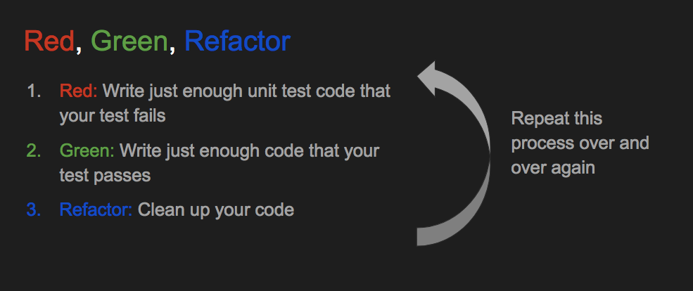
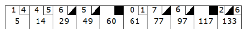
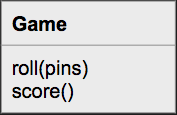

# Presentation
https://docs.google.com/presentation/d/1J3X_q5YcN0_8rj7C7L-V3hx6iDEw3VVSoQgBOjuA8-0/edit?usp=sharing

# Test Driven Development

* Write your tests first, then make them pass
* Not as weird as it seems

# Common Objection

* I don't know what code I'm going to write until after I write it.
    * You probably know what it should do (if not how)

# The Process



# Bowling Game*



* The game consists of 10 frames
* In each frame the player has two opportunities to knock down 10 pins. 
    * The score for the frame is the total number of pins knocked down, plus bonuses for strikes and spares.
* A spare is when the player knocks down all 10 pins in two tries. 
    * The bonus for that frame is the number of pins knocked down by the next roll. 
    * In frame 3 above, the score is 10 (the total number knocked down) plus a bonus of 5 (the number of pins knocked down on the next roll.)
* A strike is when the player knocks down all 10 pins on their first try. 
    * The bonus is the value of the next two balls rolled. 
    * In the tenth frame a player who rolls a spare or strike is allowed to roll the extra balls to complete the frame. 
    * No more than three balls can be rolled in tenth frame.

\* Demo gratuitously stolen from the internet

# How would you get started?



* **roll(pins)**
    * Called each time the player rolls a ball
    * Argument is the number of pins knocked down
* **score()**
    * Called at the end of the game
    * Returns the game’s total score

# Red: Create Test

`spec/lib/game_spec.rb`

```ruby
require './spec/spec_helper'

RSpec.describe Game do

end
```

* Run test:
  * uninitialized constant Game

# Green: Create Class

`lib/game.rb`

```ruby
class Game

end
```

* I'm using eager loading via `spec_helper`
* Run test:
  * No failures

* Nothing to Refactor

# Red: Add test for gutter balls

* A simple place to start is a game with no score at all.

* Get to Red
  * Write the least amount of testing code we can

```ruby
context 'when all frames are gutter balls' do
  it 'scores 0' do
    # Arrange
    game = Game.new

    # Act
    20.times do
      game.roll(0)
    end
  end
end
```

* Run tests
  * Failure: undefined method `roll' for #<Game:0x00005595487b1f28>

# Green: Add the `roll` method

* Get to Red
  * Write the least amount of code we can

```ruby
def roll(pins)

end
```

* Run tests

# Red: Add an assertion to our test:

```ruby
# Assert
expect(game.score).to eq 0
```

* undefined method `score' for #<Game:0x000055ab3d1868c8>

# Green: Add `score` method

* What's the least amount of code I could write to get this test to pass?

```ruby
def score
  0
end
```

* This is a silly bit of code
* Only works for this one test!
* That's the point!
* Our code satisfies our requirements
  * _as expressed in our test_

# Red: Test for rolling all 1s

```ruby
context 'when all rolls are 1' do
  it 'scores 20' do
    # Arrange
    game = Game.new

    # Act
    20.times do
      game.roll(1)
    end

    # Assert
    expect(game.score).to eq 20
  end
end
```

> expected: 20 <br />
> got: 0

* Our code no longer satisfies our examples
* We need to edit our class so it passes

# Green: add some state to `Game`

```ruby
def roll(pins)
  @score ||= 0
  @score += pins
end

def score
  @score
end
```

`roll` now updates a score instance variable
`score` returns the score

* Our tests pass again!

# Refactor: We can rework our tests to make them a bit easier to read

`20.times { game.roll(1) }`

* tests still pass

# Red: Let's test spares

```ruby
context 'when a spare is rolled' do
  it 'scores with correct bonus' do
    # Arrange
    game = Game.new

    # Act
    game.roll(5)
    game.roll(5)
    game.roll(3)
    17.times { game.roll(0) }

    # Assert
    expect(game.score).to eq 16
  end
end
```

expected: 16
got: 13

* Our code doesn't satisfy this requirement

* What we can do to make this test pass?
  * Maybe we add a variable to track the previous roll in `roll`?
  * But.....
  * Observation:
    * `roll` calculates score
      * name doesn't suggest this
    * `score` doesn't calculate score
      * name suggests it does
  * We need to refactor before we move forward

* TODO: Comment out spare test

# Refactor: store rolls and calculate scores

* declare a `@rolls` instance variable and store each individual roll
* calculate the score in `score`

```ruby
def roll(pins)
  @rolls ||= []
  @rolls << pins
end

def score
  @rolls.reduce(0) { |score, pins| score + pins }
end
```

* We're still green
* We might have a problem....
  * What should the score of a game be if there have been no rolls?

# Red: default score for a game with no frames

```ruby
context 'when game starts' do
  it 'scores 0' do
    # Arrange
    game = Game.new

    # assert
    expect(game.score).to eq 0
  end
end
```

* undefined method `reduce' for nil:NilClass
  * This is because `@rolls` is undefined!

# Green: add a constructor to game

```ruby
def initialize
  @rolls = []
end

def roll(pins)
  @rolls << pins
end
```

* Tests pass!

# Red: uncomment spare test

* Run tests:
* Still:

> expected: 16<br/>
> got: 13

# Try 1: how do I calculate the score when we have a spare?

* I need to know the index of the roll.
  * If roll 0 and 1 add up to 10, then this is a spare.
    * Score is 10 + the next frame <-- this is why I need to know the index!

* Maybe I could start with something like this:

```ruby
@rolls.each_with_index.reduce(0) do |score, (pins, index)|
  if pins + @rolls[index + 1] == 10
    # this is a spare?
    # do.... something
  else
    # not a spare
    score + pins
  end
end
```

* This won't work. Consider:
```ruby
roll(2)
roll(5)
roll(5)
roll(3)
```

* the two 5s don't make a spare.
* they're in different frames!
* I need to iterate over frames
  * two rolls at a time

# Try 2: how do I calculate the score when we have a spare?

* I could group rolls into frames using `@rolls.each_slice(2)`
* `Enumerable` has `each_cons` that iterates each set of consecutive items
  * https://ruby-doc.org/core-2.4.0/Enumerable.html#method-i-each_cons
* Using this, I could iterate over sets of two consecutive frames...

```ruby
def score
  frames = @rolls.
    each_slice(2).
    each_cons(2)

  frames.reduce(0) do |score, (this_frame, next_frame)|
    if this_frame[0] + this_frame[1] == 10
      score + 10 + next_frame[0]
    else
      score + this_frame[0] + this_frame[1]
    end
  end
end
```

* `each_slice` gives us this (as an enumerator):

```ruby
[[5, 5],
 [3, 0],
 [0, 0],
 [0, 0],
 [0, 0],
 [0, 0],
 [0, 0],
 [0, 0],
 [0, 0],
 [0, 0]]
```

* `each_cons` groups these frames together like so (as an enumerator):

```ruby
[[[5, 5], [3, 0]],
 [[3, 0], [0, 0]],
 [[0, 0], [0, 0]],
 [[0, 0], [0, 0]],
 [[0, 0], [0, 0]],
 [[0, 0], [0, 0]],
 [[0, 0], [0, 0]],
 [[0, 0], [0, 0]],
 [[0, 0], [0, 0]]]
``` 

* Test for spares passes!!!
  * _But not "when all rolls are 1 scores 20"!!_
  * We get 18 now.
  * This is because of how `each_cons` groups frames.
  * It's basically ignoring the last frame.

# Try 3: Get to green

* A typical game has 10 frames, but the 10th frame has a pseudo frame at the very end in case someone rolls a strike or spare in the last frames
  * What if we concat an empty frame onto the end of our frames array?

```ruby
frames = @rolls.
  concat([0, 0]).
  each_slice(2).
  each_cons(2)
```

It passes!

# Refactor: Do we see ways we can refactor?

Extract a method....

```ruby
def frames
  @rolls.
    concat([0, 0]).
    each_slice(2).
    each_cons(2)
end
```

Maybe `is_spare`?

```ruby
def is_spare(frame)
  frame[0] + frame[1] == 10
end
```

Anything else?

# Red: Test a strike

```ruby
context 'when a strike is rolled' do
  it 'scores with correct bonus' do
    # Arrange
    game = Game.new

    # Act
    game.roll(10)
    game.roll(4)
    game.roll(3)
    16.times { game.roll(0) }

    # Assert
    expect(game.score).to eq 24
  end
end
```

expected: 24
got: 17

# Green: Calculate strikes correctly

* Note: A strike skips the second roll in a frame
* I've coded myself into a corner....
  * I'm assuming that each frame has two rolls.
    * Strikes don't.
* So, I rework frames:
	* It gets a lot more complicated.

```ruby
def frames
	# loop over the rolls and group them together into arrays representing the frames
	# track the current frame I'm on, and the set of frames I've processed
  result = @rolls.reduce({frame_index: 0, frames: []}) do |state, pins|
    frames = state[:frames]
    frame_index = state[:frame_index]

		# make a frame, if we need one, and grab a reference to it
    frames << [] unless frames[frame_index]
		current_frame = frames[frame_index]

		# concat the current number of pins onto the end of this frame
    current_frame << pins

		# did we roll twice or get a strike?
    if current_frame.length == 2 || pins == 10
			# onto the next frame with you!!
      {
        frame_index: frame_index + 1,
        frames: frames
      }
    else
			# let's finish up this frame
      {
        frame_index: frame_index,
        frames: frames
      }
    end
  end

	# this is more or less the same!
  result[:frames].
    concat([0, 0]).
    each_cons(2)
end
```

* And I add a `is_strike` method:

```ruby
def is_strike(frame)
  frame[0] == 10
end
```

* Finally, I add the logic to the `score` method:

```ruby
def score
  frames.reduce(0) do |score, (this_frame, next_frame)|
    if is_strike(this_frame)
      score + 10 + next_frame[0] + next_frame[1]
    elsif is_spare(this_frame)
      score + 10 + next_frame[0]
    else
      score + this_frame[0] + this_frame[1]
    end
  end
end
```

# Red: What about all strikes?

```ruby
context 'in all frames' do
  it 'scores 300' do
    # Arrange
    game = Game.new

    # Act
    12.times { game.roll(10) }

    # Assert
    expect(game.score).to eq 300
  end
end
```

This utterly fails:
  * "nil can't be coerced into Integer"

This is because of the way I'm reading frames.
I need to go back to the drawing board....

# Green: A mess, but it works

> 0: = 0<br/>
> 1: 0    + ( 1) 10 + ( 2) 10 + ( 3) 10	= 30<br/>
> 2: 30   + ( 2) 10 + ( 3) 10 + ( 4) 10 = 60<br/>
> 3: 60   + ( 3) 10 + ( 4) 10 + ( 5) 10 = 90<br/>
> 4: 90   + ( 4) 10 + ( 5) 10 + ( 6) 10 = 120<br/>
> 5: 120   + ( 5) 10 + ( 6) 10 + ( 7) 10 = 150<br/>
> 6: 150   + ( 6) 10 + ( 7) 10 + ( 8) 10 = 180<br/>
> 7: 180   + ( 7) 10 + ( 8) 10 + ( 9) 10 = 210<br/>
> 8: 210   + ( 8) 10 + ( 9) 10 + (10) 10 = 240<br/>
> 9: 240   + ( 9) 10 + (10) 10 + ( a) 10 = 270<br/>
> 10: 270  + (10) 10 + ( a) 10 + ( b) 10 = 300<br/>

* Maybe I `each_cons` frames by 3?

```ruby
result[:frames].
  concat([0, 0]).
  each_cons(3)
```

```ruby
[[[10], [10], [10]],
 [[10], [10], [10]],
 [[10], [10], [10]],
 [[10], [10], [10]],
 [[10], [10], [10]],
 [[10], [10], [10]],
 [[10], [10], [10]],
 [[10], [10], [10]],
 [[10], [10], [10]],
 [[10], [10], [10]],
 [[10], [10], 0],
 [[10], 0, 0],
 [0, 0, 0],
 [0, 0, 0]]
```

* I'll need to update my `score` method too.
	* I could end up with up to 12 frames for all strikes
	* need to make sure I don't calculate beyond 10 frames
	* Also, I need a way to grab the scores for three strikes in a row
    * There's no second roll for a strike that happens after another strike

```ruby
i = 0
frames.reduce(0) do |score, (this_frame, next_frame, the_frame_after_that)|
  i += 1
  if i > 10
    score
  elsif is_strike(this_frame)
    score + 10 + next_frame[0] + (next_frame[1] || the_frame_after_that[0])
  elsif is_spare(this_frame)
    score + 10 + next_frame[0]
  else
    score + this_frame[0] + this_frame[1]
  end
end
```

# Refactor

* Since `frames` was such a mess I decided to refactor
* Decided to use (effectively) tail recursion in score

```ruby
def score(total: 0, frame: 1, remaining_rolls: @rolls.dup)
  return total if remaining_rolls.size == 0 || frame > 10

  # get the number of pins for this roll
  pins = remaining_rolls.shift

  if is_strike(pins)
    # strike! add these pins and peek at the next two
    score(
      total: total + pins + remaining_rolls[0] + remaining_rolls[1],
      frame: frame + 1,
    remaining_rolls: remaining_rolls
    )
  elsif is_spare(pins, remaining_rolls[0])
    # spare! add two rolls and peak at the next one
    score(
      total: total + pins + remaining_rolls.shift + remaining_rolls[0],
      frame: frame + 1,
      remaining_rolls: remaining_rolls
    )
  else
    # it's a normal roll, just add two rolls
    score(
      total: total + pins + remaining_rolls.shift,
      frame: frame + 1,
      remaining_rolls: remaining_rolls
    )
  end
end
```

* I also need to update how we calculate spares and strikes:

```ruby
def is_spare(pins1, pins2)
  pins1 + pins2 == 10
end

def is_strike(pins)
  pins == 10
end
```

# Conclusions

* TDD drove the design of the game class
* End result was not necessarily what we expected
* Allowed us to safely refactor our code as we progressed
    * We can be confident that our code works as expected
